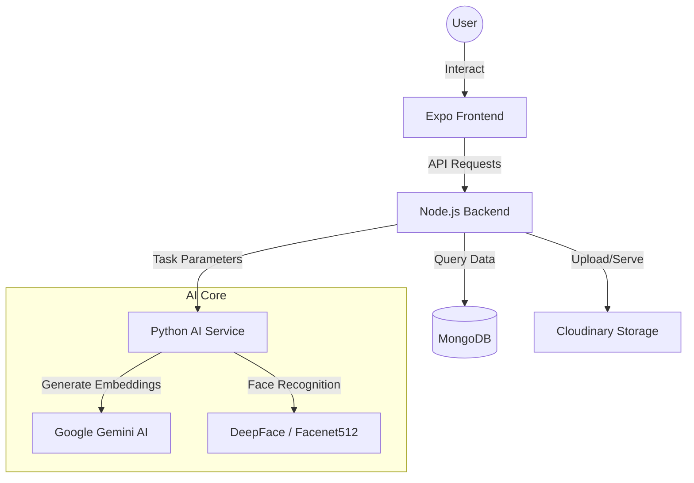

# 🖼️ Galleria AI Chat Bot

A premium, AI-powered gallery application that combines **Natural Language Search** with **Face Identity Recognition**.

Find your memories not just by what's in the photo (e.g., "sunset at the beach"), but by **who** is in them (e.g., "me at the party").

---

## 🏗️ System Architecture

---

## ✨ Key Features

- **Personal Identity Search**: Enrollment system captures your face photos and generates unique embeddings.
- **Natural Language Chat**: Ask the AI anything (e.g., "Show me photos where I enjoyed Holi festival").
- **State-of-the-Art Embeddings**: Powered by the **recently launched `google-embedding-2-preview`** model, enabling a unified vector space for highly accurate multimodal search.
- **Smart Intent Detection**: Automatically distinguishes between general queries and personal identity searches.
- **Cloud Sync**: Securely store and index your life's moments with Cloudinary and MongoDB.

---

## 🛠️ Tech Stack

| Layer | Technology |
| :--- | :--- |
| **Frontend** | React Native, Expo |
| **Backend** | Node.js, Express |
| **Database** | MongoDB (Mongoose) |
| **AI Processing** | Python 3.11+, DeepFace (Facenet512) |
| **Generative AI** | Google Gemini (**embedding-2-preview**, Flash 2.5) |
| **Storage** | Cloudinary |

---

## 🚀 Getting Started

### 1. Backend Setup (`/server`)
1. Navigate to the server directory: `cd server`
2. Install dependencies: `npm install`
3. Create a `.env` file (see Configuration below).
4. Start the server: `npm run dev`

### 2. AI Service Setup
1. Ensure Python 3.11+ is installed.
2. Install requirements (DeepFace, google-genai, numpy, etc.).
3. The AI service is automatically bridged via the Node.js backend.

### 3. Frontend Setup
1. Navigate to the project root: `cd ..`
2. Install dependencies: `npm install`
3. Start Expo: `npx expo start`

---

## ⚙️ Configuration (.env)

Set the following environment variables in `server/.env`:

| Variable | Description | Example |
| :--- | :--- | :--- |
| `PORT` | Local server port | `4000` |
| `MONGODB_URI` | Connection string for MongoDB | `mongodb://...` |
| `JWT_SECRET` | Secret key for auth tokens | `your-secret-key` |
| `GOOGLE_API_KEY` | Key for Google Gemini API | `AIza...` |
| `CLOUDINARY_CLOUD_NAME` | Cloudinary cloud name | `...` |
| `CLOUDINARY_API_KEY` | Cloudinary API key | `...` |
| `CLOUDINARY_API_SECRET`| Cloudinary API secret | `...` |

---

## 🛡️ License
Distributed under the MIT License. See `LICENSE` for more information.
